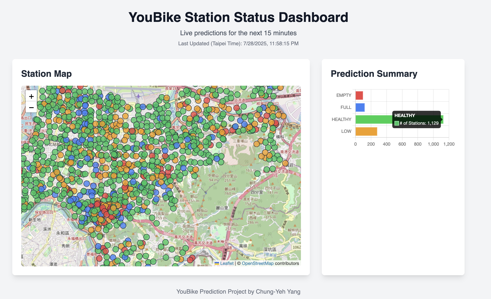

# YouBike Station Availability Prediction

### Introduction

As a frequent YouBike user in Taipei, I sometimes found myself frustrated by the limitations of the official app. It shows the real-time availability of bikes, but it can't predict the near future. More than once, I'd spot a station with one or two bikes available, only to walk there and find them already gone. This gap between real-time data and future reality is the problem this project aims to solve.

By leveraging the official [YouBike API](https://data.taipei/dataset/detail?id=c6bc8aed-557d-41d5-bfb1-8da24f78f2fb), this project builds an end-to-end machine learning system to forecast station availability 15 minutes into the future. The goal is to provide a more reliable picture of which stations are at risk of becoming `EMPTY` (no bikes) or `FULL` (no docks), helping users make better decisions and improving the overall YouBike experience.

---

## 🚀 Live Demo

A live dashboard is deployed to visualize the model's predictions for the next 15 minutes. The data is updated automatically every 15 minutes by the production pipeline.

**[➡️ View the Live Dashboard Here](https://olivery0307.github.io/YouBike_Status_Prediction/)**




---

### Project Summary

This project demonstrates a full MLOps lifecycle proof-of-concept, from data ingestion and model training to a fully automated, containerized deployment on AWS.

* **Data Pipeline:** A serverless AWS Lambda function collects real-time station data every 5 minutes and stores it in S3.
* **Prediction Pipeline:** A Dockerized AWS Lambda function loads a trained model and generates live predictions every 15 minutes.
* **Model Performance:** The trained `LightGBM` model is highly effective at identifying critical states 15 minutes in advance, achieving **90% recall** for `FULL` stations and **77% recall** for `EMPTY` stations.

---

### Architecture

#### 1. Data Collection Pipeline
* **Amazon EventBridge:** Triggers the process every 5 minutes.
* **AWS Lambda:** A Python function (`lambda_function.py`) fetches and processes the data.
* **Amazon S3:** Stores the raw and processed data in Parquet format.

#### 2. Prediction Pipeline (Inference)
* **Docker & Amazon ECR:** The prediction application, including all dependencies, is packaged as a Docker container image and stored in the Elastic Container Registry (ECR).
* **Amazon EventBridge:** Triggers the pipeline every 15 minutes.
* **AWS Lambda:** A function configured to run from the Docker container image executes the prediction logic.
* **Amazon S3:** The trained model artifact (`.joblib` file) is stored here, and the final predictions are saved as `.csv` and `.json` files.

---

### Next Steps

The data collection and prediction pipelines are currently running continuously. The immediate next steps are:

1.  **Model Monitoring:** Continue collecting data for a longer period (e.g., three months) to capture more diverse usage patterns (seasonal changes, holidays, weather events).
2.  **Performance Evaluation:** Regularly evaluate the live model's predictions against the actual outcomes to monitor for performance degradation or "model drift."
3.  **Automated Retraining (CI/CD):** Based on the evaluation, design and implement a CI/CD pipeline (e.g., using AWS SageMaker or GitHub Actions) to automate the process of retraining, evaluating, and deploying new versions of the model.

---

### How to Use This Repository

#### Running the Analysis Notebooks
To explore the data preparation and model training process:

1.  **Set up the environment:**
    ```bash
    # Create and activate a virtual environment
    python3 -m venv venv
    source venv/bin/activate

    # Install required packages
    pip install -r requirements.txt
    ```

2.  **Launch Jupyter and run the notebooks:**
    ```bash
    jupyter lab
    ```
    Open and run the notebooks inside the `notebooks/` directory.

#### Building and Running the Prediction Service
The prediction service is a self-contained Docker application.

1.  **Navigate to the service directory:**
    ```bash
    cd services/prediction_service/
    ```

2.  **Build the Docker image:**
    ```bash
    docker build -t youbike-prediction-service .
    ```
